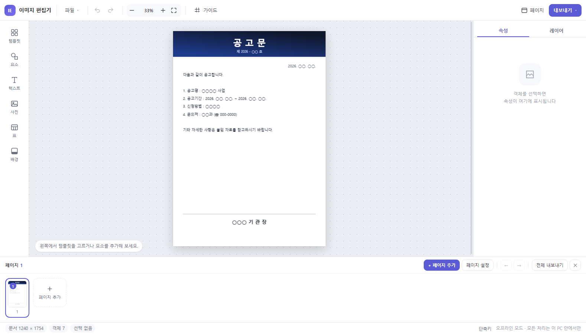
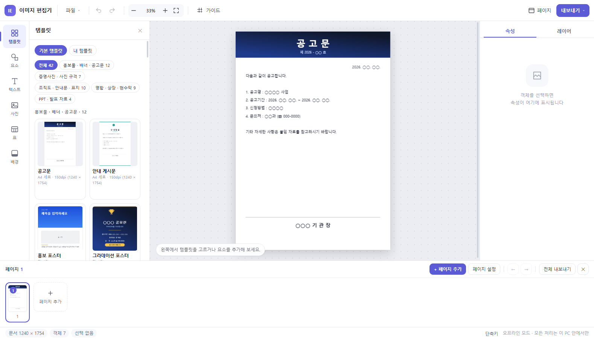
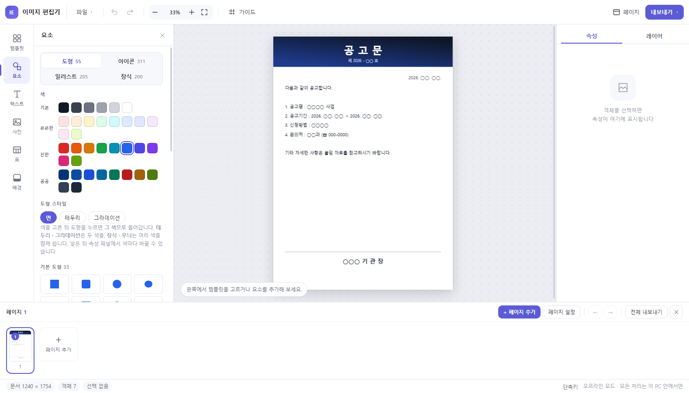
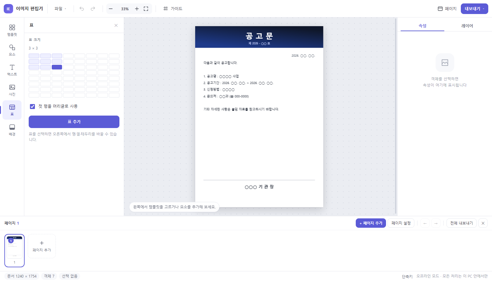
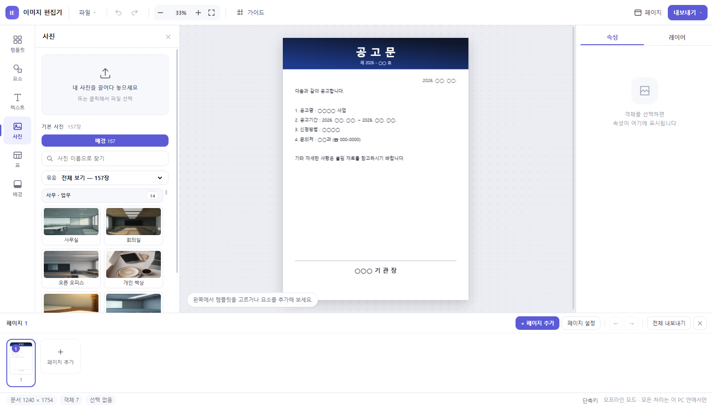
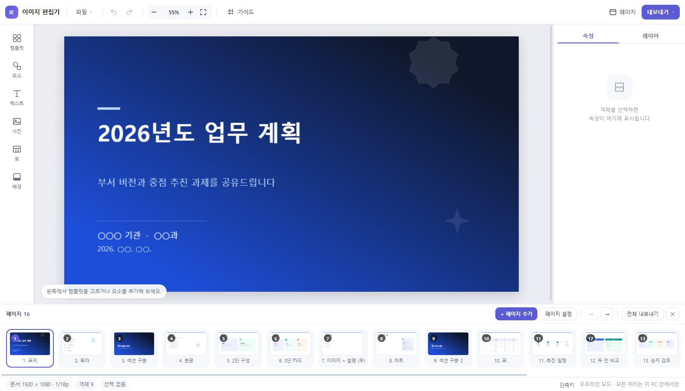

# [붙임 1] AI 활용 업무혁신 혁신과제 제안서

| 항 목 | 세 부 기 재 내 용 |
| :--- | :--- |
| **과 제 명** | **폐쇄 행정망 전용 안심 시각화 웹 플랫폼 「안심 디자인」 개발** *(공인 안심 자원 탑재 및 개인정보 실시간 마스킹 기반 공공 시각행정 체계)* |
| **제안 배경 및 필요성** | **□ 비인가 폰트·이미지 사용에 따른 저작권 분쟁 리스크 상존**   ○ **(비인가 리소스 유입 위험)** 실무자의 저작권 인식 부족 및 무료 오인으로 비인가 폰트·인터넷 이미지를 사용하여 저작권법 위반 민원 및 분쟁 위험 상존   ○ **(공인 디자인 자원 결여)** 공무원의 법적 준수 의무에도 불구하고, 행정 현장에서 안심하고 쓸 수 있는 공인 라이선스 디자인 자산 체계 미비  **□ 망분리 보안 환경에 따른 저작 도구 부재 및 개인정보 유출 취약**   ○ **(상용 웹 도구 차단)** 강력한 망분리 규제로 민간 클라우드 그래픽 플랫폼 접속이 원천 차단되어 현업 부서 자체 제작 환경 부재   ○ **(개인정보 노출 위험)** 홍보물·공고문 제작 및 대외 배포 시 민원인 얼굴, 담당자 연락처, 주민번호, 군번 등 민감정보 수기 검증 누락에 따른 유출 사고 우려  **□ 저작권 안심·개인정보 보호를 일원화한 완전 오프라인 자체 솔루션 절실**   ○ **(완전 오프라인 구동)** 인터넷 연결이나 별도 서버 설치 없이 폐쇄 행정망 PC에서 단일 HTML 파일로 즉시 작동하는 안전한 자체 저작 환경 필요   ○ **(사전 보안 검증 체계)** 공인 라이선스 자원 제공과 개인정보 실시간 마스킹을 원클릭으로 사전 검증하여 행정 신뢰도 확보 및 법적 위험 원천 차단 |
| **연구분야** | 고객지원 / 정보기획 / 행정혁신 (행정업무 효율화 및 대국민 소통 강화) |
| **소속기관** | |
| **대표직원 (1인)** | |
| **참여인원** | |
| **과제 개요 및 추진내용** | **□ 과제 개요**   ○ **(추진 목적)** 폐쇄 행정망 환경에서 저작권 침해와 개인정보 유출 걱정 없이 고품질 시각 홍보물·공문서를 신속하게 자체 제작할 수 있는 업무망 전용 웹 플랫폼 구축   ○ **(개발 형태)** 별도 프로그램 설치 없이 내부망 웹 브라우저에서 즉시 접속·활용하는 무설치 경량 웹 애플리케이션  **□ 주요 추진 내용**   ○ **(1단계: 안심 디자인 환경 구축)** 문체부 안심글꼴 및 공공누리 제1유형 자원 탑재, 생성형 AI 기반 맞춤 일러스트 정기 공급, 표준 규격 마법사 구현   ○ **(2단계: 개인정보 점검 체계 구현)** 6대 민감정보(주민번호·전화번호·군번·이메일·성명·얼굴) 실시간 자동 탐지·원클릭 마스킹 엔진 및 외부 파일 저작권 확인 장치 구축   ○ **(3단계: 실무 서식 자산화 및 확산)** 95종 표준 서식 라이브러리 및 경량 단일 파일(`*.json`) 저장·공유 체계를 통한 인사이동 시 업무 연속성 보장 |
| **워크메이트 활용 (가점-5점)** | **□ [업무 연계] AI 워크메이트 기반 행정 안내문 추출**   ○ **(공식 안내문 연계)** 내부 RAG(AI 워크메이트)로 병역판정검사, 입영 모집, 병역의무 이행 등 핵심 제도 안내 문구 자동 검색·요약   ○ **(정확도 제고)** 요약된 공식 행정 문구를 「안심 디자인」 서식에 즉시 적용하여 담당자별 안내 문구 누락 및 오기재 방지  **□ [민원 분석] 다빈도 문의 중심 맞춤 서식 개발**   ○ **(이력 데이터 분석)** 병역의무자 다빈도 문의 데이터를 분석하여 시각적 안내가 시급한 정보 취약 분야 식별   ○ **(전용 템플릿 제작)** 질병별 구비서류 안내, 모바일 복무 확인서 발급 절차 등을 전용 카드뉴스 및 인포그래픽 서식으로 개발하여 대국민 전달력 강화 |
| **활용 모델** | **□ 생성형 AI (Imagen / Gemini Pro) & 브라우저 비전 모델**   ○ **(시각 에셋 정기 생성)** 이미지 생성 AI를 활용하여 계절별·테마별(병역판정, 입영, 복무 등) 맞춤형 일러스트, 배경 이미지, 벡터 아이콘을 주기적으로 자체 생성·추가   ○ **(알고리즘 최적화)** 정규식(Regex) 기반 텍스트 보안 패턴 및 브라우저 얼굴 탐지 신경망 경량화 구현  **□ 병무청 내부 AI 워크메이트**   ○ **(행정 지식 연계)** 행정 안내 문구의 공문서 어법 준수 여부 사전 검토 및 표준 병무 용어 통일화에 활용 |
| **구현 방법** | **□ 실시간 개인정보 점검·마스킹 엔진**   ○ **(전용 점검 패널)** 좌측 패널에서 6대 항목(주민등록번호, 휴대전화, 군번, 이메일, 성명, 인물 얼굴) 선택 점검   ○ **(정밀 탐지 알고리즘)** 주민번호(`\d{6}-[1-4]\d{6}`), 군번(`\d{2}-\d{2}\d{4,6}`), 연락처, 이메일, 성명 등 5대 텍스트 패턴 및 캔버스 내 사진 얼굴 자동 탐지   ○ **(원클릭 안심 마스킹)** 텍스트는 `010-****-1234`, `00-00****` 등 공공 표준으로 자동 치환하고, 인물 얼굴은 자연스러운 모자이크·블러 처리 적용   ○ **(로컬 완결 처리)** 외부 서버 전송 없이 사용자 PC 메모리(RAM) 내에서만 처리하여 유출 위험 원천 차단  **□ 공인 안심 자원 탑재 및 AI 생성 그래픽 확충**   ○ **(AI 일러스트·도형 정기 공급)** 생성형 AI로 병무 테마(입영, 판정, 복무 등) 맞춤형 일러스트와 아이콘을 주기적으로 자체 생성·공급하여 풍부한 시각 자원 상시 확충   ○ **(공공 안심글꼴 내장)** 문체부 안심글꼴 및 오픈소스(SIL OFL) 표준 서체(Pretendard, Noto Sans, 검은고딕 등) 기본 내장으로 폰트 분쟁 제로화   ○ **(공공누리 제1유형 활용)** 95종 서식, 311종 공공 벡터 아이콘, 162장 사진 전수 라이선스 검증 완료   ○ **(외부 자료 안심 확인)** 이미지 업로드 시 *"저작권·초상권에 문제없는 공공·자체 저작물임을 확인합니다"* 플로팅 팝업 표출로 실무자 법적 준수 의무 상시 환기  **□ 행정 규격 마법사 및 실무 편집 도구**   ○ **(원클릭 규격 세팅)** 새 문서 생성 시 행정 홍보물 표준 규격(가로형 현수막 2400×800, 포스터 A4/A3, SNS 카드뉴스 1080×1080, 발표자료 1920×1080, 증명사진 3.5×4.5cm) 즉시 적용   ○ **(모서리 곡률 정밀 제어)** 행정 배너용 버튼(예: [방문예약하기])을 위한 모서리 반경(Radius) 조절 및 캡슐형 반원 원클릭 프리셋 지원   ○ **(스마트 표 편집기)** 셀 병합·분할, 공공 배색 테두리 및 배경색 지정 등 행정 문서 서식 전용 표 작성 도구 제공   ○ **(오프라인 사진 보정)** 인물 사진 배경 투명화(누끼 분리), 윤곽 교정(리퀴파이), 공무원 증명사진 규격 자동 맞춤   *▲ [화면 1] 「안심 디자인」 메인 에디터 및 작업 캔버스*  **□ 병무행정 표준 95종 실무 서식**   ○ 행정 서식 29종: 기안문, 시행문, 협조전, 출장명령, 지출품의, 감사보고 등   ○ 대국민 안내 32종: 공고문, 포스터, 카드뉴스, 행사 배너 등   ○ 발표자료 14세트(152슬라이드): 표지·목차·본문·결론 완결형 덱 자동 생성   ○ 증명사진 규격 7종: 여권, 주민등록, 공무원증(3.5×4.5cm) 등 표준 세팅   *▲ [화면 2] 95종 실무 서식 라이브러리*  | 그래픽 요소 패널 | 스마트 표 편집 패널 | | :---: | :---: | |  |  | | *▲ [화면 3] 벡터 아이콘 및 도형 패널* | *▲ [화면 4] 스마트 표 편집 패널* |  **□ 템플릿 공유 기반 서식 자산화 체계**   ○ **(단일 파일 저장·공유)** 제작된 디자인 작업물을 경량 템플릿 파일(`*.json`)로 내보내어 부서 간 안전하게 공유   ○ **(공유자료실 및 공모대회)** 내부망 '안심 서식 자료실' 구축 및 '우수 템플릿 공모전'을 정기 개최하여 우수 제작 사례 상시 발굴·탑재   ○ **(디자인 역량 상향평준화)** 검증된 표준 서식을 전 직원이 자유롭게 재활용함으로써 비전문 공무원의 시각 디자인 역량을 동반 상향평준화하고 인사이동 시 업무 연속성 보장  | 사진 라이브러리 및 보정 툴 | 16:9 발표자료(PPT 덱) 저작 | | :---: | :---: | |  |  | | *▲ [화면 5] 사진 라이브러리 및 보정 툴* | *▲ [화면 6] 16:9 발표자료 저작 및 슬라이드 쇼* | |
| **데이터활용** | **□ 공공누리 제1유형 등 개방 자산 활용**   ○ **(라이선스 검증 자산)** 국가 및 지자체 개방 제1유형 공공 저작물과 열린데이터 광장 통계 연동  **□ 메모리 기반 휘발성 데이터 처리**   ○ **(데이터 유출 차단)** 사진 및 입력 텍스트 등 일체의 작업 데이터는 PC 브라우저 메모리(RAM) 내에서만 처리되며 창 종료 시 즉시 소멸   ○ **(오프라인 완결 구조)** 외부 네트워크 패킷 전송량 0 바이트 구조로 폐쇄 행정망 보안 규정 100% 준수 |
| **세부 개선 내용** | **[현행 (AS-IS)]** ㆍ인터넷 비인가 폰트·이미지 무단 사용으로 저작권 침해 분쟁 및 법적 리스크 상존 ㆍ수작업 검증 누락으로 얼굴·연락처·군번 노출 사고 및 개인정보 유출 민원 빈발 ㆍ행정 규격을 몰라 수동 사이즈 입력 시 비율 왜곡 및 규격 불일치 재작업 발생 ㆍ인사이동 시 기존 서식 유실 및 개인 역량 편차로 인한 디자인 품질 불균일 ㆍ망분리로 웹 디자인 툴 접속 차단 및 단순 홍보물도 외주 용역 의존 (수십만 원 소요)  **[개선 (TO-BE)]** ㆍ**공인 안심글꼴 탑재 및 AI 일러스트 정기 공급**으로 고품질 디자인 자원 지속 확충 ㆍ**6대 개인정보 점검 패널**을 통한 원클릭 얼굴 블러 및 번호 마스킹 완료 ㆍ**새 문서 규격 마법사** 및 모서리 곡률·캡슐형 버튼 정밀 제어로 규격 불일치 해소 ㆍ**서식 공유자료실 및 템플릿 공모전**을 통해 전 직원 디자인 역량 상향평준화 및 인수인계 완결 ㆍ내부망 웹사이트 접속 및 단일 HTML 실행으로 외주비 제로화 및 20분 내 홍보물 자체 제작 |
| **기대 효과 및 추후 확산 계획** | **□ 정량적 효과**   ○ **(저작권 분쟁 제로화)** 폰트 및 이미지 저작권 침해 관련 분쟁 및 소송 발생률 **0건 달성**   ○ **(개인정보 노출 제로화)** 홍보물 내 얼굴, 연락처, 군번 등 개인정보 유출 민원 및 지적 **0건 달성**   ○ **(예산 절감 효과)** 디자인 외주 용역비 및 상용 소프트웨어 라이선스 구매 예산 **연간 수천만 원 절감**   ○ **(업무 시간 단축)** 홍보 안내문 제작 시간 **4시간 ➔ 20분(91.7% 단축)**, 보고·발표자료 제작 시간 **12시간 ➔ 1시간(91.7% 단축)**  **□ 정성적 효과**   ○ **(시각 자산의 지속적 트렌드 반영)** 생성형 AI를 통한 정기적인 신규 일러스트·도형 공급으로 시각 자원의 노후화 방지 및 플랫폼 활용성 극대화   ○ **(직원 디자인 역량 상향평준화)** 우수 서식 공유자료실과 사내 공모전을 통해 비전문 공무원의 시각 행정 제작 수준 대폭 향상   ○ **(행정 지식 자산화)** 부서별 완성형 서식 축적 및 공유를 통해 순환보직에 따른 인수인계 공백 해소   ○ **(대국민 행정 신뢰도 제고)** 통일된 공공 비주얼 아이덴티티와 정제된 디자인으로 기관 이미지 향상  **□ 단계별 확산 계획**   ○ **1단계(시범 운영, '26.상)**: 본청 주요 홍보·운영 부서 웹 서비스 시범 오픈, 개인정보 스캔 및 저작권 팝업 실무 검증   ○ **2단계(전국 확산, '26.하)**: 14개 지방병무청 전 부서 배포, 내부망 공유자료실 개설 및 제1회 안심 서식 공모전 개최   ○ **3단계(대외 전파, '27.이후)**: 국방부 및 타 정부 부처, 공공기관 대상 공공 안심 시각화 모델 공유 및 템플릿 보급 |
